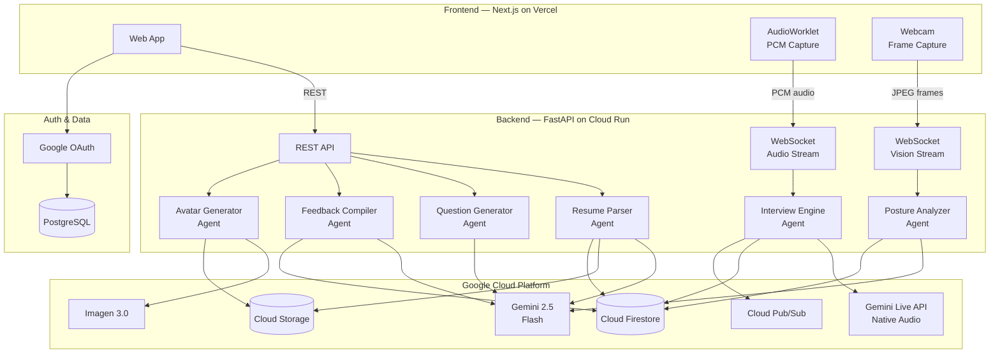
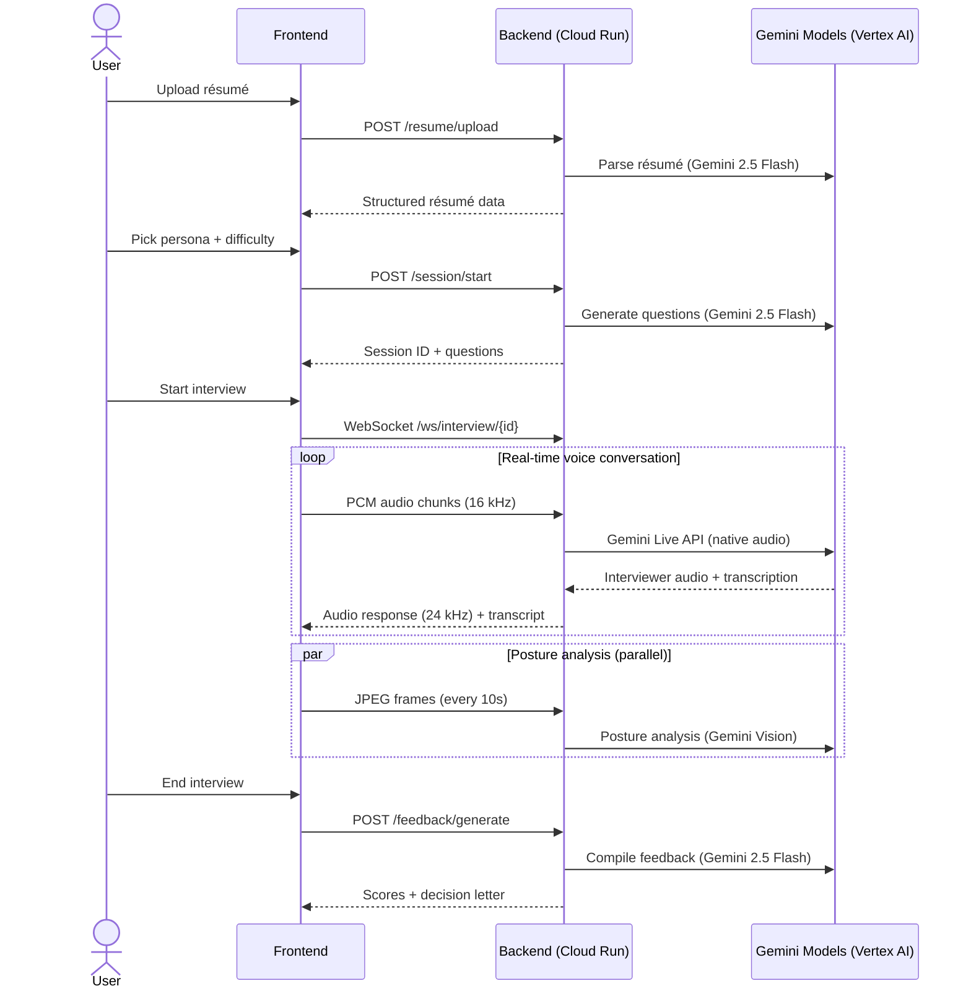
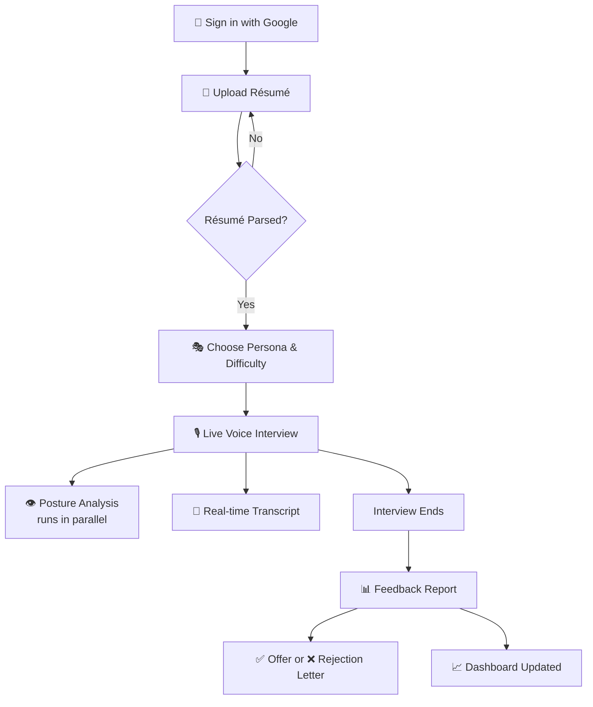

# MockMate

> **Interview practice, without the nerves.**

MockMate is an AI-powered mock interview platform that conducts real, adaptive interview sessions using **voice**, **vision**, and **résumé-personalized** question generation. It analyzes not just _what_ you say but _how_ you say it — scoring your tone, posture, vocabulary, and confidence in real time. At the end of every session, you receive a detailed feedback report and a mock hiring decision letter, so you walk into every real interview already knowing how it ends.

**Live demo:** [getmockmate.com](https://www.getmockmate.com)

> This project was built for the [Gemini Live Agent Challenge](https://geminiliveagentchallenge.devpost.com/) hackathon — category: **Live Agents 🗣️**

---

## Table of Contents

- [The Problem](#-the-problem)
- [The Solution](#-the-solution)
- [Key Features](#-key-features)
- [Demo Video](#-demo-video)
- [Architecture](#-architecture)
- [Technologies Used](#-technologies-used)
- [Quick Start (Local Setup)](#-quick-start-local-setup)
- [Project Structure](#-project-structure)
- [Cloud Deployment](#-cloud-deployment)
- [Proof of Google Cloud Deployment](#-proof-of-google-cloud-deployment)
- [How It Works — User Flow](#-how-it-works--user-flow)
- [What Makes MockMate Different](#-what-makes-mockmate-different)
- [Findings & Learnings](#-findings--learnings)
- [Content & Community](#-content--community)
- [License](#-license)

---

## 🎯 The Problem

Job interviews are high-stakes and almost impossible to practice realistically. Candidates rehearse alone in mirrors or pay hundreds for coaching they can only afford once. Existing AI platforms are text-based, generic, or only evaluate _after_ the session. None simulate the real emotional dynamics of a live interview — the pressure, the follow-ups, the silence. None of them _see_ you. And none tell you honestly whether you would have gotten the job.

## 💡 The Solution

MockMate is a real-time AI interview coach. Upload your résumé → pick an interviewer persona → sit down and talk. MockMate interviews you live with voice, watches your body language through your webcam, and at the end delivers a full multimodal feedback report with a mock hiring decision letter.

```
Upload Résumé  →  Pick Persona & Difficulty  →  Live Voice Interview  →  Get Feedback + Decision Letter
```

---

## ✨ Key Features

| Feature | Description |
|---------|-------------|
| 📄 **Résumé-Aware Questions** | Reads your actual résumé and generates hyper-personalized questions. Claim you led a team of 30? Expect to be asked how you handled underperformance. |
| 🎭 **13 Interviewer Personas** | From a warm HR manager to an aggressive investment banker, an algorithm guru to a system designer — each with distinct questioning styles, pressure levels, speech patterns, and follow-up behaviors. |
| ⚡ **Adaptive Follow-ups** | The interviewer asks probing follow-ups, challenges weak answers, and digs deeper into your claims — just like a real interviewer would. |
| 👁️ **Posture & Presence Vision** | Webcam-based scoring of posture, eye contact, and facial confidence in real time using Gemini Vision. |
| 🎙️ **Live Native Audio** | Real-time bidirectional voice interview through the Gemini Live API — not text-to-speech, but native audio generation with natural intonation, interruption support, and persona-specific accents. |
| 📬 **Mock Hiring Decision** | A simulated offer or rejection letter with personalized reasoning — making feedback feel consequential. |
| 📈 **Skill Progression Dashboard** | Tracks improvement across communication, confidence, structure, technical depth, and domain vocabulary over time. |
| 🌗 **Dark Mode** | Full dark/light/system theme support across the entire application. |

---

## 🎬 Demo Video

<!-- PLACEHOLDER: Replace with your YouTube/Vimeo link -->
[](YOUR_YOUTUBE_LINK_HERE)

> A 4-minute walkthrough showing MockMate in action — from résumé upload through a live voice interview to the final feedback report and hiring decision.

---

## 🏗️ Architecture

### System Architecture Diagram



### Agent Pipeline

The backend is composed of **6 specialized AI agents**, each handling a distinct part of the interview workflow:

| Agent | Model Used | What It Does |
|-------|-----------|-------------|
| **ResumeParserAgent** | Gemini 2.5 Flash | Extracts structured JSON from PDF/DOCX résumés, stores raw files in Cloud Storage, persists structured data in Firestore |
| **QuestionGeneratorAgent** | Gemini 2.5 Flash | Generates 8 personalized interview questions based on the candidate's résumé, chosen persona, and difficulty level |
| **InterviewEngineAgent** | Gemini Live API (native audio) | Manages the live bidirectional voice interview session — handles real-time audio streaming, adaptive follow-ups, interruption support, and transcript persistence |
| **PostureAnalyzerAgent** | Gemini 2.5 Flash (Vision) | Scores posture, eye contact, and facial confidence from webcam frames captured every 10 seconds |
| **FeedbackCompilerAgent** | Gemini 2.5 Flash | Aggregates transcript, posture data, and session metadata to produce a detailed feedback report with scores across 6 dimensions and a mock hiring decision letter |
| **InterviewerAvatarAgent** | Imagen 3.0 Fast | Generates and caches AI profile pictures for each interviewer persona |



---

## 🛠️ Technologies Used

### Gemini Models & Google AI

| Technology | Usage in MockMate |
|-----------|-------------------|
| **Gemini Live API** (native audio) | Powers the real-time bidirectional voice interview — the core feature. Handles natural speech, interruptions, follow-ups, and persona-specific accents/intonation. |
| **Gemini 2.5 Flash** | Used by 4 agents: résumé parsing (structured JSON extraction), question generation (personalized to résumé + persona), posture analysis (vision-based scoring from webcam), and feedback compilation (multi-source aggregation into scored report). |
| **Imagen 3.0 Fast** | Generates unique AI profile pictures for each interviewer persona, cached in Cloud Storage. |
| **Google ADK (Agent Development Kit)** | Orchestrates the InterviewEngineAgent — manages live sessions, request queues, and streaming to/from the Gemini Live API. |
| **Vertex AI** | All Gemini and Imagen model calls are routed through Vertex AI endpoints. |

### Google Cloud Services

| Service | How MockMate Uses It |
|---------|---------------------|
| **Cloud Run** | Hosts the FastAPI backend as a serverless container. Handles auto-scaling, HTTPS termination, and WebSocket upgrades for live interviews. |
| **Cloud Firestore** | Primary database for all application data — sessions, transcripts, parsed résumés, feedback reports, and posture scores. |
| **Cloud Storage (GCS)** | Stores raw résumé files (PDF/DOCX) and generated interviewer avatar images. |
| **Cloud Pub/Sub** | Publishes async `session-end` events when an interview concludes, enabling decoupled post-processing. |

### Application Stack

| Layer | Technology |
|-------|-----------|
| **Frontend** | Next.js 16 (App Router, Turbopack), React 19, TailwindCSS 4, shadcn/ui (Radix), TanStack React Query |
| **Backend** | FastAPI, Python 3.13, WebSockets, Uvicorn |
| **Auth** | Better Auth with Google OAuth → PostgreSQL |
| **Real-time Audio** | Browser AudioWorklet (PCM Int16 @ 16 kHz capture, 24 kHz playback) |
| **Real-time Video** | react-webcam (768×768 JPEG frames every 10 seconds) |
| **Deployment** | Cloud Run (backend), Vercel (frontend) |

---

## 🚀 Quick Start (Local Setup)

### Prerequisites

| Tool | Version | Why | Install |
|------|---------|-----|---------|
| **Python** | 3.13 | Backend runtime. Pre-built wheels for all deps. | [python.org/downloads](https://www.python.org/downloads/) |
| **Node.js** | 18+ | Frontend runtime | [nodejs.org](https://nodejs.org/) |
| **Google Cloud SDK** | latest | Auth + deploy | [cloud.google.com/sdk](https://cloud.google.com/sdk/docs/install) |
| **PostgreSQL** | 14+ | Better Auth session storage | [postgresql.org](https://www.postgresql.org/download/) |

You also need a **Google Cloud project** with the following APIs enabled:
- Vertex AI API
- Cloud Firestore API
- Cloud Storage API
- Cloud Pub/Sub API

And a **Google OAuth 2.0 Client ID** (for user login).

### Step 1 — Clone the repository

```bash
git clone https://github.com/YOUR_USERNAME/mockmate.git
cd mockmate
```

### Step 2 — Set up the backend

```bash
cd backend

# Create and activate a virtual environment
python3.13 -m venv .venv
source .venv/bin/activate        # macOS / Linux
# .venv\Scripts\activate         # Windows

# Install dependencies
pip install --upgrade pip
pip install -r requirements.txt

# Configure environment variables
cp .env.example .env
# Open .env and fill in your GCP project ID, region, bucket name,
# Postgres credentials, and other values. See .env.example for guidance.

# Authenticate with Google Cloud
gcloud auth application-default login
gcloud config set project YOUR_PROJECT_ID
gcloud auth application-default set-quota-project YOUR_PROJECT_ID

# Start the server
python main.py
# Backend is now running at http://localhost:8080
# Interactive API docs at http://localhost:8080/docs
```

### Step 3 — Set up the frontend

```bash
cd frontend

# Install dependencies
npm install

# Configure environment variables
cp .env.example .env.local
# Open .env.local and fill in:
#   NEXT_PUBLIC_API_URL=http://localhost:8080
#   BETTER_AUTH_SECRET, BETTER_AUTH_URL
#   GOOGLE_CLIENT_ID, GOOGLE_CLIENT_SECRET
#   PGHOST, PGPORT, PGUSER, PGPASSWORD, PGDATABASE

# Start the dev server
npm run dev
# Frontend is now running at http://localhost:3000
```

### Step 4 — Use MockMate

1. Open http://localhost:3000 in your browser
2. Sign in with Google
3. Upload your résumé (PDF or DOCX)
4. Choose an interviewer persona and difficulty level
5. Start the live voice interview — speak naturally through your microphone
6. When the interview ends, view your feedback report and mock hiring decision

> For more detailed setup instructions, see the [backend README](./backend/README.md) and [frontend README](./frontend/README.md).

---

## 📂 Project Structure

```
mockmate/
├── README.md                           # This file
├── LICENSE                             # MIT License
│
├── backend/                            # FastAPI backend (Python)
│   ├── main.py                         # REST + WebSocket endpoints, lifespan
│   ├── Dockerfile                      # Multi-stage production container
│   ├── requirements.txt                # Python dependencies
│   ├── .env.example                    # Environment variable template
│   └── agents/
│       ├── config.py                   # Shared configuration & env var loading
│       ├── resume_parser.py            # Résumé extraction with Gemini Flash
│       ├── question_generator.py       # Personalized question generation
│       ├── interview_engine.py         # Live audio interview via Gemini Live API
│       ├── posture_analyzer.py         # Webcam posture scoring via Gemini Vision
│       ├── feedback_compiler.py        # Post-session feedback & decision letter
│       ├── interviewer_avatar.py       # AI avatar generation with Imagen 3.0
│       └── personas.json              # 13 interviewer persona definitions
│
├── frontend/                           # Next.js web app (TypeScript)
│   ├── src/
│   │   ├── app/                        # Pages (App Router)
│   │   │   ├── dashboard/              # Session history, stats, quick actions
│   │   │   ├── interview/
│   │   │   │   ├── setup/              # Persona & difficulty selection
│   │   │   │   ├── live/               # Real-time voice interview engine
│   │   │   │   └── feedback/           # Post-interview feedback report
│   │   │   ├── resume/                 # Résumé upload & preview
│   │   │   ├── sessions/               # Full session history
│   │   │   └── login/                  # Google OAuth login
│   │   ├── components/                 # Reusable UI components (shadcn/ui)
│   │   ├── constants/common.ts         # Shared constants & helpers
│   │   └── lib/                        # API client, auth, utilities
│   ├── public/
│   │   └── audio-processor.worklet.js  # PCM audio capture worklet
│   ├── package.json
│   └── next.config.ts
│
└── deploy.sh                           # Cloud Run deployment script
```

---

## ☁️ Cloud Deployment

### Backend → Google Cloud Run

The backend is containerized with a multi-stage Dockerfile and deployed on Cloud Run:

```bash
# Build container image using Cloud Build
gcloud builds submit --tag gcr.io/YOUR_PROJECT/mockmate-backend ./backend

# Deploy to Cloud Run
gcloud run deploy mockmate-backend \
  --image gcr.io/YOUR_PROJECT/mockmate-backend \
  --platform managed \
  --region us-central1 \
  --memory 2Gi \
  --timeout 3600 \
  --allow-unauthenticated \
  --set-env-vars "GOOGLE_CLOUD_PROJECT=YOUR_PROJECT,GOOGLE_CLOUD_LOCATION=us-central1,GCS_BUCKET=YOUR_BUCKET,GOOGLE_GENAI_USE_VERTEXAI=TRUE"
```

Or use the deployment script:

```bash
chmod +x deploy.sh
./deploy.sh
```

### Frontend → Vercel

The frontend is deployed on Vercel with environment variables configured in the Vercel dashboard:

```bash
cd frontend
npx vercel --prod
```

Set these environment variables in Vercel:
- `NEXT_PUBLIC_API_URL` → your Cloud Run backend URL (e.g., `https://mockmate-backend-xxxxx.run.app`)
- `BETTER_AUTH_SECRET`, `BETTER_AUTH_URL`, `GOOGLE_CLIENT_ID`, `GOOGLE_CLIENT_SECRET`
- PostgreSQL connection variables (`PGHOST`, `PGPORT`, `PGUSER`, `PGPASSWORD`, `PGDATABASE`)

---

## ✅ Proof of Google Cloud Deployment

MockMate's backend runs entirely on Google Cloud. Here is the proof:

<!-- PLACEHOLDER: Add ONE of the following:
     Option 1: A short screen recording showing the Cloud Run service in the GCP Console
     Option 2: Links to code files that demonstrate GCP service usage
-->

**Code-level proof of Google Cloud service usage:**

| GCP Service | Code File | What It Does |
|-------------|-----------|-------------|
| Vertex AI + Gemini Live API | [`backend/agents/interview_engine.py`](./backend/agents/interview_engine.py) | Lines using `vertexai.init()`, `Agent()`, `Runner()`, and `LiveRequestQueue` for real-time audio streaming via the Gemini Live API |
| Vertex AI + Gemini Flash | [`backend/agents/feedback_compiler.py`](./backend/agents/feedback_compiler.py) | Uses `GenerativeModel("gemini-2.5-flash")` via Vertex AI to compile feedback reports |
| Cloud Firestore | [`backend/agents/config.py`](./backend/agents/config.py) | Centralised Firestore collection names; used in every agent via `firestore.AsyncClient()` |
| Cloud Storage | [`backend/agents/resume_parser.py`](./backend/agents/resume_parser.py) | Uploads raw résumé files to GCS via `storage.Client()` |
| Cloud Pub/Sub | [`backend/agents/interview_engine.py`](./backend/agents/interview_engine.py) | Publishes `session-end` events via `pubsub_v1.PublisherClient()` |
| Imagen 3.0 (Vertex AI) | [`backend/agents/interviewer_avatar.py`](./backend/agents/interviewer_avatar.py) | Generates interviewer avatars via `ImageGenerationModel` |
| Cloud Run | [`backend/Dockerfile`](./backend/Dockerfile) | Multi-stage container deployed to Cloud Run |

---

## 🎬 How It Works — User Flow

1. **Sign in** — Log in with your Google account (OAuth 2.0 via Better Auth).
2. **Upload résumé** — Drag and drop your PDF or DOCX. Gemini Flash parses it into structured data (skills, experience, education, bold claims).
3. **Choose your interviewer** — Pick from 13 personas (e.g., Startup Founder, Investment Banker, Algorithm Guru) and set your difficulty level (easy, medium, hard).
4. **Live interview** — A real-time voice conversation begins. The AI interviewer asks personalized questions, follows up on your answers, challenges weak points, and adapts its questioning style based on your responses. Your webcam captures posture data in the background.
5. **Get feedback** — After the interview ends, Gemini Flash compiles all data (transcript, posture scores, résumé context) into a detailed feedback report scoring you across 6 dimensions: communication, confidence, structure, technical depth, domain vocabulary, and posture.
6. **Hiring decision** — You receive a mock offer or rejection letter with specific reasoning, making the feedback feel real and consequential.
7. **Track progress** — Your dashboard shows session history, score trends, and skill progression over time.



---

## 🏆 What Makes MockMate Different

Most interview platforms evaluate **what you say**. MockMate evaluates **who you are under pressure** — your voice, your body language, your vocabulary, your ability to handle tough follow-ups.

It is the only platform that combines:
- ✅ **Live voice interviewing** — not text-based; a real conversation powered by Gemini Live API with native audio
- ✅ **Real-time vision analysis** — not post-session review; live posture/confidence scoring during the interview
- ✅ **Résumé personalization** — not generic questions; every question is grounded in your actual experience and claims
- ✅ **Adaptive follow-ups** — not predictable scripts; the AI digs deeper based on your answers
- ✅ **Persona diversity** — 13 distinct interviewer personalities with unique speech styles, accents, and pressure levels
- ✅ **Consequential decisions** — not vague suggestions; a real offer or rejection letter with specific reasoning

All in a single, seamless session.

---

## 📝 Findings & Learnings

Building MockMate taught us several things about working with Gemini and Google Cloud:

1. **Gemini Live API is remarkably natural** — The native audio mode produces speech that feels genuinely human. Personas with different accents and speech patterns (fast-talking startup founders vs. measured consultants) emerge naturally from the system prompt without any special TTS configuration.

2. **Prompt engineering is the real product work** — Getting each of the 13 personas to feel distinct required extensive prompt iteration. We added structured SPEECH STYLE blocks (tone, pace, warmth, filler words, energy) and ACCENT GUIDANCE (22 accent types) to make each interviewer feel like a real person.

3. **AudioWorklet is essential for real-time audio** — The Web Audio API's AudioWorklet runs on a separate thread, which is critical for capturing PCM audio at 16 kHz without drops while the main thread handles UI updates and transcript rendering.

4. **Vision analysis adds genuine value** — Even simple posture/eye-contact scoring from webcam frames makes feedback significantly more actionable. Candidates often don't realize they're looking away from the camera or slouching until they see the data.

5. **The ADK simplifies agent orchestration** — Google's Agent Development Kit handled session management, request queuing, and streaming to/from the Gemini Live API, letting us focus on the product logic rather than infrastructure plumbing.

6. **Firestore's flexibility accelerated development** — The schemaless nature of Firestore let us iterate on data structures (sessions, transcripts, feedback reports) without migration overhead. Each agent writes to its own collection, keeping concerns cleanly separated.

---

## 📢 Content & Community

<!-- PLACEHOLDER: Add links to any blog posts, videos, or podcasts you publish about building MockMate -->

- **Blog post:** [YOUR_BLOG_POST_LINK_HERE]
- **Google Developer Group Profile:** [Link](https://gdg.community.dev/u/mzf4ez/#/about)

> All content was created for the purposes of entering the [Gemini Live Agent Challenge](https://geminiliveagentchallenge.devpost.com/) hackathon. #GeminiLiveAgentChallenge

---

## 📜 License

[MIT](./LICENSE)