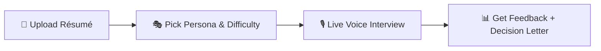
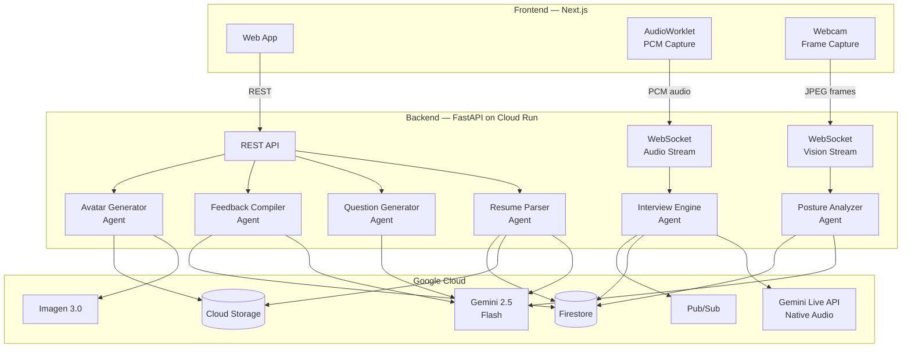
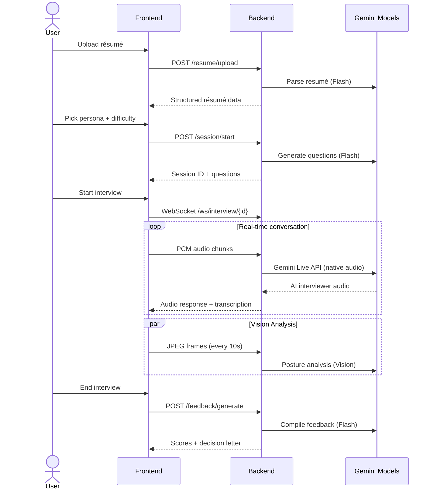
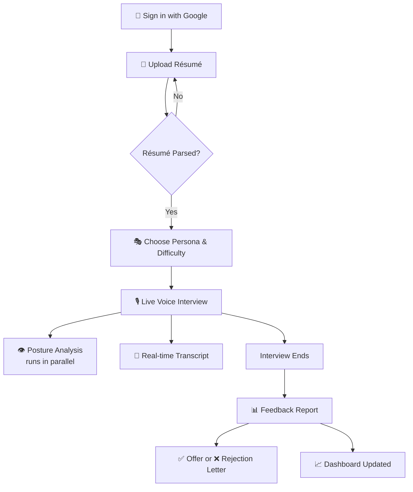

# MockMate

> **Interview practice, without the nerves.**

MockMate is an AI-powered mock interview platform that conducts real, adaptive interview sessions using **voice**, **vision**, and **résumé-personalized** question generation. It analyzes not just _what_ you say but _how_ you say it — scoring your tone, posture, vocabulary, and confidence in real time. At the end of every session, you receive a detailed feedback report and a mock hiring decision letter, so you walk into every real interview already knowing how it ends.

Built for the [Gemini Live Agent Challenge](https://geminiliveagentchallenge.devpost.com/) hackathon — category: **Live Agents 🗣️**

---

## 🎯 The Problem

Job interviews are high-stakes and almost impossible to practice realistically. Candidates rehearse alone in mirrors or pay hundreds for coaching they can only afford once. Existing AI platforms are text-based, generic, or only evaluate _after_ the session. None simulate the real emotional dynamics of a live interview — the pressure, the follow-ups, the silence. None of them _see_ you. And none tell you honestly whether you would have gotten the job.

## 💡 The Solution

MockMate is a real-time AI interview coach. Upload your résumé → pick an interviewer persona → sit down and talk. MockMate interviews you live with voice, watches your body language through your webcam, and at the end delivers a full multimodal feedback report with a mock hiring decision letter.



---

## ✨ Key Features

| Feature | Description |
|---------|-------------|
| 📄 **Résumé-Aware Questions** | Reads your actual résumé and generates hyper-personalized questions. Claim you led a team of 30? Expect to be asked how you handled underperformance. |
| 🎭 **12 Interviewer Personas** | From a warm HR manager to an aggressive investment banker, an algorithm guru to a system designer — each with distinct questioning styles, pressure levels, and follow-up behaviors. |
| ⚡ **Adaptive Follow-ups** | The interviewer asks probing follow-ups, challenges weak answers, and digs deeper into your claims — just like a real interviewer would. |
| 👁️ **Posture & Presence Vision** | Webcam-based scoring of posture, eye contact, and facial confidence in real time using Gemini Vision. |
| 📬 **Mock Hiring Decision** | A simulated offer or rejection letter with personalized reasoning — making feedback feel consequential. |
| 📈 **Skill Progression Dashboard** | Tracks improvement across communication, confidence, structure, technical depth, and domain vocabulary. |

---

## 🏗️ Architecture



### Agent Pipeline



---

## 🛠️ Technologies Used

### Gemini Models & Google AI

| Technology | Usage |
|-----------|-------|
| **Gemini Live API** (native audio) | Real-time bidirectional voice interview with interruption support |
| **Gemini 2.5 Flash** | Résumé parsing, question generation, posture analysis, feedback compilation |
| **Imagen 3.0 Fast** | AI-generated interviewer profile avatars |
| **Google ADK** | Agent orchestration and Live API streaming |
| **Vertex AI** | All model calls routed through Vertex AI |

### Google Cloud Services

| Service | Purpose |
|---------|---------|
| **Cloud Run** | Serverless container hosting for the backend |
| **Cloud Firestore** | Sessions, transcripts, résumés, feedback, posture scores |
| **Cloud Storage** | Raw résumé files and generated interviewer avatars |
| **Cloud Pub/Sub** | Async `session-end` event handling |

### Application Stack

| Layer | Technology |
|-------|-----------|
| **Frontend** | Next.js 16, React 19, TailwindCSS, Radix UI, React Query |
| **Backend** | FastAPI, Python 3.13, WebSockets, Uvicorn |
| **Auth** | Better Auth (Google OAuth) with PostgreSQL |
| **Real-time Audio** | AudioWorklet (PCM Int16 @ 16 kHz capture, 24 kHz playback) |

---

## 🚀 Quick Start

### Prerequisites

- **Python 3.13** — [python.org/downloads](https://www.python.org/downloads/)
- **Node.js 18+** — [nodejs.org](https://nodejs.org/)
- **Google Cloud SDK** — [cloud.google.com/sdk](https://cloud.google.com/sdk/docs/install)
- A GCP project with Firestore, Cloud Storage, and Pub/Sub enabled

### 1. Clone the repo

```bash
git clone https://github.com/your-org/mockmate.git
cd mockmate
```

### 2. Start the backend

```bash
cd backend
python3.13 -m venv .venv
source .venv/bin/activate
pip install -r requirements.txt
cp .env.example .env   # Fill in your GCP project details
gcloud auth application-default login
python main.py          # Runs on http://localhost:8080
```

### 3. Start the frontend

```bash
cd frontend
npm install
cp .env.example .env    # Set NEXT_PUBLIC_API_URL=http://localhost:8080
npm run dev             # Runs on http://localhost:3000
```

> For detailed setup instructions, see the [backend README](./backend/README.md) and [frontend README](./frontend/README.md).

---

## 📂 Project Structure

```
mockmate/
├── frontend/                    # Next.js web application
│   ├── src/
│   │   ├── app/                 # Pages and routes
│   │   │   ├── dashboard/       # User dashboard with session history
│   │   │   ├── interview/
│   │   │   │   ├── setup/       # Persona & difficulty selection
│   │   │   │   ├── live/        # Real-time interview engine
│   │   │   │   └── feedback/    # Post-interview feedback report
│   │   │   ├── resume/          # Résumé upload & preview
│   │   │   └── login/           # Google OAuth login
│   │   ├── components/          # Reusable UI components
│   │   └── lib/                 # API client, auth, utilities
│   └── public/
│       └── audio-processor.worklet.js  # PCM audio capture
│
├── backend/                     # FastAPI application
│   ├── main.py                  # REST + WebSocket endpoints
│   ├── agents/
│   │   ├── resume_parser.py     # Résumé extraction with Gemini
│   │   ├── question_generator.py# Personalized question generation
│   │   ├── interview_engine.py  # Live audio interview via Gemini Live API
│   │   ├── posture_analyzer.py  # Webcam posture scoring via Gemini Vision
│   │   ├── feedback_compiler.py # Post-session feedback & decision letter
│   │   ├── interviewer_avatar.py# AI avatar generation with Imagen
│   │   └── personas.json        # 10 interviewer persona definitions
│   ├── Dockerfile               # Multi-stage production image
│   └── requirements.txt
│
└── README.md
```

---

## ☁️ Cloud Deployment

The backend is containerized and deployed on **Google Cloud Run**:

```bash
# Build and push
gcloud builds submit --tag gcr.io/YOUR_PROJECT/mockmate-backend ./backend

# Deploy
gcloud run deploy mockmate-backend \
  --image gcr.io/YOUR_PROJECT/mockmate-backend \
  --platform managed \
  --region us-central1 \
  --memory 2Gi \
  --allow-unauthenticated
```

---

## 🎬 How It Works — User Flow



---

## 🏆 What Makes MockMate Different

Most interview platforms evaluate **what you say**. MockMate evaluates **who you are under pressure** — your voice, your body language, your vocabulary, your ability to handle tough follow-ups.

It is the only platform that combines:
- ✅ Live voice interviewing (not text-based)
- ✅ Real-time vision analysis (not post-session)
- ✅ Résumé personalization (not generic questions)
- ✅ Adaptive follow-ups and challenges (not predictable)
- ✅ Consequential hiring decisions (not vague feedback)

All in a single, seamless session.

---

## 📜 License

[MIT](./LICENSE)