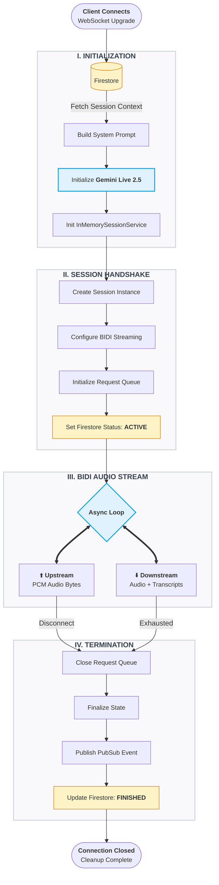

# MockMate - AI Agents

Standalone ADK project for developing and testing the MockMate Live interviewer agent.

## Structure

```
ai-agents/
├── interviewer/
│   ├── __init__.py   # re-exports root_agent & build_agent
│   └── agent.py      # Agent definition + build_agent() factory
├── .env.example      # environment variable template
├── requirements.txt  # Python dependencies
└── README.md
```

---

## Architecture

### 1 — End-to-end audio data flow

```mermaid
sequenceDiagram
    participant Browser as Browser (Next.js)
    participant WS as FastAPI WebSocket
    participant Engine as InterviewEngineAgent (interview_engine.py)
    participant Queue as LiveRequestQueue (ADK)
    participant Runner as ADK Runner + Agent
    participant Gemini as Gemini Live API (Vertex AI)

    Browser->>WS: WS connect /ws/interview/{session_id}
    WS->>Engine: run_live_session(websocket, session_id)
    Engine->>Engine: load session + build system prompt
    Engine->>Runner: create Agent + Runner (per session)
    Engine->>Queue: new LiveRequestQueue()

    par Upstream task
        loop Every ~100 ms
            Browser-->>WS: binary frame (Int16 PCM 16 kHz)
            WS-->>Engine: iter_bytes()
            Engine-->>Queue: send_realtime(Blob audio/pcm&#59;rate=16000)
            Queue-->>Gemini: stream audio input
        end
    and Downstream task
        loop ADK events
            Gemini-->>Runner: audio output + transcripts
            Runner-->>Engine: async for event in run_live(...)
            Engine-->>WS: send_text(event JSON)
            Engine-->>WS: send_bytes(PCM 24 kHz audio)
            WS-->>Browser: JSON event (transcripts / turn_complete)
            WS-->>Browser: binary frame (Int16 PCM 24 kHz)
        end
    end

    Browser->>WS: send {"type":"end"}
    Engine->>Queue: close()
    Engine->>Firestore: update status → ended
    Engine->>PubSub: publish session-end event
```



---

### 2 — ADK streaming lifecycle



---

## Quick start (local dev with `adk web`)

```bash
cd ai-agents

# Create and activate a virtual environment
python -m venv .venv
source .venv/bin/activate      # Windows: .venv\Scripts\activate

# Install dependencies
pip install -r requirements.txt

# Configure environment
cp .env.example .env           # fill in your GCP project / API key

# Run the ADK dev UI at http://localhost:8000
adk web
```

The ADK web UI lets you chat with the agent in a browser with voice support.

## Integration

The `build_agent(system_prompt, model)` factory is imported by
`backend/agents/interview_engine.py` at session start to create a
session-specific agent whose system prompt embeds:

- Interviewer **persona** (Friendly / Neutral / Aggressive / Technical / HR)
- Target **job role** and seniority
- Full **question set** generated by `QuestionGeneratorAgent`

---

## Deploying to Cloud Run

The ADK API server (`adk api_server`) is the production entry-point. It exposes
REST endpoints (`/run`, `/run_sse`) that the backend's `InterviewEngineAgent`
calls during live sessions. A `Dockerfile` is included at the root of this
directory.

### Prerequisites

| Requirement | Notes |
|---|---|
| Docker (or Cloud Build) | For building the image |
| `gcloud` CLI authenticated | `gcloud auth login && gcloud auth configure-docker` |
| Artifact Registry repo | Created in the steps below |
| Service account | With the roles listed in the IAM section below |

---

### 1 — Create an Artifact Registry repository (once)

```bash
export PROJECT_ID=your-gcp-project-id
export REGION=us-central1
export REPO=mockmate-agents

gcloud artifacts repositories create $REPO \
  --repository-format=docker \
  --location=$REGION \
  --project=$PROJECT_ID
```

---

### 2 — Build and push the image

```bash
export IMAGE=$REGION-docker.pkg.dev/$PROJECT_ID/$REPO/interviewer

# Build
docker build -t $IMAGE .

# Push
docker push $IMAGE
```

Or use **Cloud Build** to build remotely (no local Docker required):

```bash
gcloud builds submit --tag $IMAGE .
```

---

### 3 — Deploy to Cloud Run

```bash
gcloud run deploy mockmate-interviewer \
  --image=$IMAGE \
  --region=$REGION \
  --project=$PROJECT_ID \
  --platform=managed \
  --port=8080 \
  --min-instances=1 \
  --max-instances=10 \
  --cpu=2 \
  --memory=2Gi \
  --timeout=3600 \
  --service-account=mockmate-agent-sa@$PROJECT_ID.iam.gserviceaccount.com \
  --set-env-vars="GOOGLE_GENAI_USE_VERTEXAI=TRUE,GOOGLE_CLOUD_PROJECT=$PROJECT_ID,GOOGLE_CLOUD_LOCATION=$REGION" \
  --no-allow-unauthenticated
```

> **`--no-allow-unauthenticated`** — only the backend service account can invoke
> this service. Remove this flag only for debugging.

> **`--min-instances=1`** — keeps one instance warm to avoid cold-start latency
> during live WebSocket audio sessions.

> **`--timeout=3600`** — Live interviews can run up to ~60 min; Cloud Run's
> default 300 s timeout would terminate active sessions.

---

### 4 — Grant the backend permission to call this service

The Cloud Run backend service needs `roles/run.invoker` on this service:

```bash
gcloud run services add-iam-policy-binding mockmate-interviewer \
  --member="serviceAccount:mockmate-backend-sa@$PROJECT_ID.iam.gserviceaccount.com" \
  --role="roles/run.invoker" \
  --region=$REGION
```

---

### 5 — Set the service URL in the backend

After deployment, retrieve the service URL and add it to the **backend** `.env`:

```bash
gcloud run services describe mockmate-interviewer \
  --region=$REGION \
  --format="value(status.url)"
```

```dotenv
# backend/.env
ADK_AGENT_URL=https://mockmate-interviewer-xxxx-uc.a.run.app
```

---

### IAM roles required for the agent service account

The service account specified in `--service-account` above needs:

| Role | Purpose |
|---|---|
| `roles/aiplatform.user` | Call Gemini Live API on Vertex AI |
| `roles/datastore.user` | Read/write Firestore session documents |
| `roles/pubsub.publisher` | Publish session-end events |
| `roles/logging.logWriter` | Write structured logs to Cloud Logging |

Create the service account and grant roles:

```bash
export SA=mockmate-agent-sa

gcloud iam service-accounts create $SA \
  --display-name="MockMate Agent SA" \
  --project=$PROJECT_ID

for ROLE in roles/aiplatform.user roles/datastore.user roles/pubsub.publisher roles/logging.logWriter; do
  gcloud projects add-iam-policy-binding $PROJECT_ID \
    --member="serviceAccount:$SA@$PROJECT_ID.iam.gserviceaccount.com" \
    --role="$ROLE"
done
```

---

### Environment variables on Cloud Run

All are set via `--set-env-vars` in the deploy command above. For secrets
(e.g. API keys), use **Secret Manager** instead of plain env vars:

```bash
# Store a secret
gcloud secrets create GOOGLE_API_KEY --data-file=- <<< "your-api-key"

# Grant the SA access to it
gcloud secrets add-iam-policy-binding GOOGLE_API_KEY \
  --member="serviceAccount:$SA@$PROJECT_ID.iam.gserviceaccount.com" \
  --role="roles/secretmanager.secretAccessor"

# Reference in the deploy command
# --set-secrets="GOOGLE_API_KEY=GOOGLE_API_KEY:latest"
```

---

### Continuous deployment (optional)

Connect this directory to **Cloud Build** triggers so every push to `main`
rebuilds and redeploys automatically:

```bash
gcloud beta builds triggers create github \
  --repo-name=mockmate \
  --repo-owner=your-github-org \
  --branch-pattern="^main$" \
  --build-config=ai-agents/cloudbuild.yaml
```

A minimal `cloudbuild.yaml`:

```yaml
steps:
  - name: gcr.io/cloud-builders/docker
    args: [build, -t, "$_IMAGE", .]
    dir: ai-agents
  - name: gcr.io/cloud-builders/docker
    args: [push, "$_IMAGE"]
  - name: gcr.io/google.com/cloudsdktool/cloud-sdk
    args:
      - gcloud
      - run
      - deploy
      - mockmate-interviewer
      - --image=$_IMAGE
      - --region=$_REGION
      - --platform=managed
      - --quiet
substitutions:
  _REGION: us-central1
  _IMAGE: us-central1-docker.pkg.dev/$PROJECT_ID/mockmate-agents/interviewer
```

---

## Required GCP setup

| Step | Details |
|---|---|
| Enable Vertex AI API | <https://console.cloud.google.com/apis/library/aiplatform.googleapis.com> |
| Service account role | `roles/aiplatform.user` (or `roles/aiplatform.admin`) |
| ADC credentials | `gcloud auth application-default login` |
| Region | `us-central1` recommended (Live API GA region) |

## Environment variables

| Variable | Required | Default | Description |
|---|---|---|---|
| `GOOGLE_GENAI_USE_VERTEXAI` | Yes | `TRUE` | `TRUE` → Vertex AI; `FALSE` → AI Studio key |
| `GOOGLE_CLOUD_PROJECT` | If Vertex | — | GCP project ID |
| `GOOGLE_CLOUD_LOCATION` | If Vertex | — | GCP region (e.g. `us-central1`) |
| `GOOGLE_API_KEY` | If Studio | — | Gemini AI Studio API key |
| `MOCKMATE_LIVE_MODEL` | No | `gemini-live-2.5-flash-native-audio` | Override Live model |
