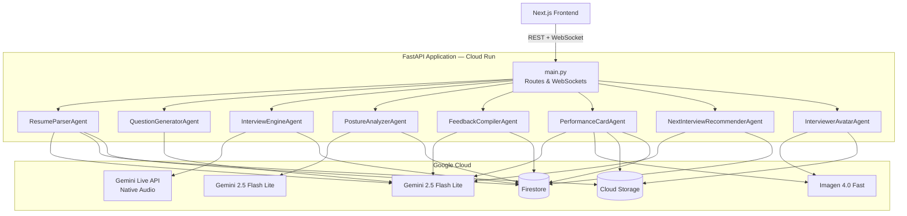
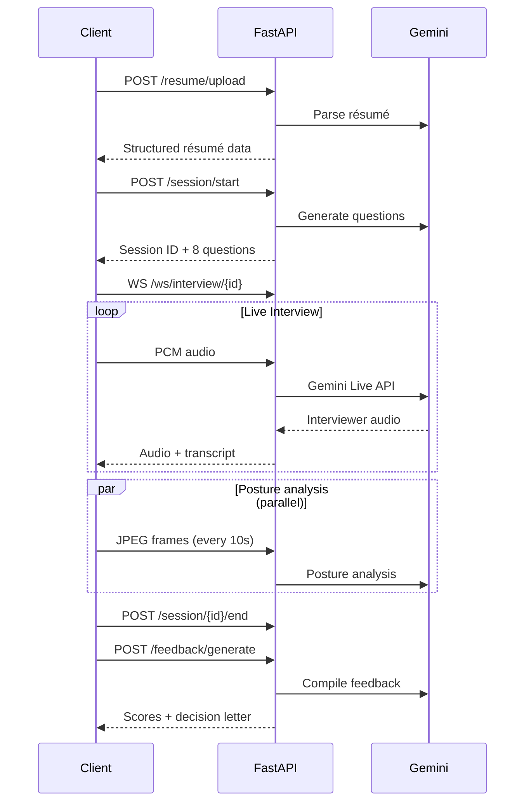

# MockMate — Backend

FastAPI backend for [MockMate](https://www.getmockmate.com) — an AI-powered mock interview platform built for the [Gemini Live Agent Challenge](https://geminiliveagentchallenge.devpost.com/). It exposes REST and WebSocket endpoints consumed by the Next.js frontend and orchestrates **8 Google Gemini-powered agents** via the ADK.

---

## Architecture



### Agent Responsibilities

| Agent | Model | What It Does |
|-------|-------|-------------|
| **ResumeParserAgent** | Gemini 2.5 Flash Lite | Extracts structured JSON from PDF/DOCX résumés, stores in GCS + Firestore |
| **QuestionGeneratorAgent** | Gemini 2.5 Flash Lite | Generates 8 personalized questions based on résumé, persona, and difficulty |
| **InterviewEngineAgent** | Gemini Live API (native audio) | Manages live bidirectional audio interviews with interruption support, persona-specific accents, and adaptive follow-ups |
| **PostureAnalyzerAgent** | Gemini 2.5 Flash Lite (Vision) | Scores posture, eye contact, and facial confidence from webcam frames |
| **FeedbackCompilerAgent** | Gemini 2.5 Flash Lite | Compiles post-interview feedback report with scores across 6 dimensions and a mock hiring decision letter |
| **PerformanceCardAgent** | Gemini 2.5 Flash Lite + Imagen 4.0 Fast | Generates an AI performance card per session — Imagen creates a unique artistic background themed to the persona, role, and score; Gemini writes a motivational quote. Cached in GCS + Firestore |
| **NextInterviewRecommenderAgent** | Gemini 2.5 Flash Lite | Analyzes recent feedback sessions to find the weakest skill dimension and recommends a targeted persona, job role, and practice focus for the next interview |
| **InterviewerAvatarAgent** | Imagen 4.0 Fast | Generates and caches AI profile pictures for interviewer personas |

### Google Cloud Services

| Service | Purpose |
|---------|---------|
| **Vertex AI** | All Gemini model calls |
| **Gemini Live API** | Real-time audio interview streaming |
| **Cloud Firestore** | Sessions, transcripts, résumés, feedback, posture scores |
| **Cloud Storage** | Raw résumé files + generated avatars |
| **Cloud Run** | Serverless container hosting |

---

## Prerequisites

| Tool | Version | Install |
|------|---------|---------|
| **Python** | **3.13** | [python.org/downloads](https://www.python.org/downloads/) |
| **Google Cloud SDK** | latest | [cloud.google.com/sdk](https://cloud.google.com/sdk/docs/install) |

> **Why 3.13?** Pre-built wheels for all dependencies. Python 3.14 has known build issues with pillow and pydantic-core on macOS.

---

## Local Setup

### 1. Create virtual environment

```bash
cd backend
python3.13 -m venv .venv
source .venv/bin/activate   # macOS/Linux
# .venv\Scripts\activate    # Windows
```

### 2. Install dependencies

```bash
pip install --upgrade pip
pip install -r requirements.txt
```

### 3. Configure environment

```bash
cp .env.example .env
```

Fill in your GCP project details in `.env`. See `.env.example` for all required variables.

### 4. Authenticate with Google Cloud

```bash
gcloud auth application-default login
gcloud config set project YOUR_PROJECT_ID
gcloud auth application-default set-quota-project YOUR_PROJECT_ID
```

Or use a service account key:
```bash
export GOOGLE_APPLICATION_CREDENTIALS="/path/to/key.json"
```

Required IAM roles: `roles/aiplatform.user`, `roles/storage.objectAdmin`, `roles/datastore.user`

### 5. Run the server

```bash
python main.py
# Or with hot-reload:
uvicorn main:app --host 0.0.0.0 --port 8080 --reload
```

API available at **http://localhost:8080** | Interactive docs at **http://localhost:8080/docs**

---

## API Reference

### REST Endpoints

| Method | Path | Description |
|--------|------|-------------|
| `GET` | `/health` | Liveness check |
| `POST` | `/resume/upload?user_id=<id>` | Upload and parse résumé (PDF/DOCX/TXT, max 10 MB) |
| `GET` | `/resume/{user_id}` | Get parsed résumé |
| `GET` | `/resume/{user_id}/file` | Stream raw résumé file from GCS |
| `POST` | `/session/start` | Create interview session with generated questions |
| `POST` | `/session/{session_id}/end` | End session |
| `GET` | `/session/{session_id}` | Get session metadata |
| `GET` | `/sessions/user/{user_id}` | List user sessions (paginated) |
| `GET` | `/transcript/{session_id}` | Get full transcript |
| `POST` | `/feedback/generate` | Generate feedback report |
| `GET` | `/feedback/{session_id}` | Get existing feedback |
| `GET` | `/performance-card/{session_id}` | Get performance card metadata (score, decision, motivational line) |
| `GET` | `/performance-card/{session_id}/image` | Stream the AI-generated performance card background image from GCS |
| `GET` | `/analytics/next-interview/{user_id}` | Get AI-powered next interview recommendation (persona, role, focus) |
| `GET` | `/interviewer-avatar/{name}` | Get/generate interviewer avatar |

### WebSocket Endpoints

| Path | Description |
|------|-------------|
| `ws://…/ws/interview/{session_id}` | Bidirectional audio interview stream |
| `ws://…/ws/vision/{session_id}` | Posture analysis video frame stream |

### End-to-End Flow



### Interviewer Personas

13 distinct personas available: `neutral`, `startup_founder`, `investment_banker`, `tech_lead`, `hr_manager`, `product_manager`, `vp_engineering`, `management_consultant`, `cto`, `recruiter`, `algorithm_guru`, `system_designer`, `prompt_wizard`

Each persona has 4–6 named interviewers with unique voices, accents, and speech styles (tone, pace, warmth, filler words, etc.).

---

## Docker

```bash
# Build
docker build -t mockmate-backend .

# Run
docker run -p 8080:8080 --env-file .env mockmate-backend
```

## Deploy to Cloud Run

```bash
# Build container image using Cloud Build
gcloud builds submit --tag gcr.io/YOUR_PROJECT/mockmate-backend

# Deploy to Cloud Run (reads env vars from cloudrun-env.yaml)
gcloud run deploy mockmate-backend \
  --image gcr.io/YOUR_PROJECT/mockmate-backend \
  --platform managed \
  --region us-central1 \
  --memory 2Gi \
  --timeout 3600 \
  --allow-unauthenticated \
  --env-vars-file cloudrun-env.yaml
```

Or use the deployment script:

```bash
chmod +x deploy.sh
./deploy.sh
```

You can also deploy from the repo root:

```bash
chmod +x deploy.sh
./deploy.sh backend
```

---

## Project Structure

```
backend/
├── main.py                    # FastAPI app — routes, WebSocket handlers, lifespan
├── requirements.txt           # Python dependencies
├── Dockerfile                 # Multi-stage production image
├── .env.example               # Environment variable template
└── agents/
    ├── config.py              # Shared configuration & env var loading
    ├── resume_parser.py       # Résumé extraction → GCS + Firestore
    ├── question_generator.py  # Personalized question generation
    ├── interview_engine.py    # Gemini Live API session management
    ├── posture_analyzer.py    # Real-time video posture scoring
    ├── feedback_compiler.py   # Post-session feedback & decision letter
    ├── performance_card.py    # AI performance card (Imagen 4.0 background + Gemini quote)
    ├── next_interview_recommender.py  # Next interview recommendation engine
    ├── interviewer_avatar.py  # AI avatar generation with Imagen
    └── personas.json          # 13 interviewer persona definitions
```
