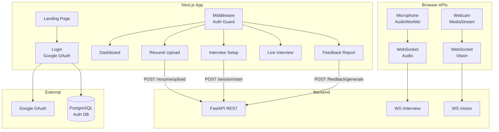
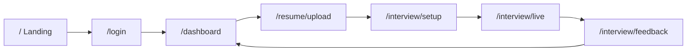
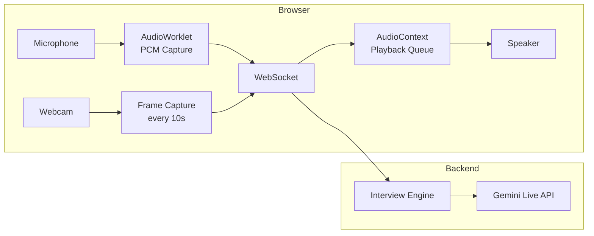
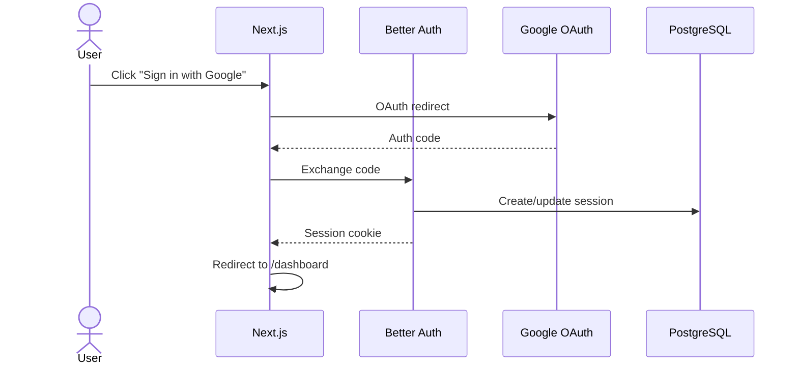

# MockMate — Frontend

Next.js web application for [MockMate](https://www.getmockmate.com) — the real-time AI mock interview platform built for the [Gemini Live Agent Challenge](https://geminiliveagentchallenge.devpost.com/). Handles Google OAuth, résumé upload, live voice/video interview streaming, and post-session feedback display.

---

## Architecture



---

## Pages & User Flow



| Route | Description |
|-------|-------------|
| `/` | Landing page — hero, features, personas, how-it-works |
| `/login` | Google OAuth sign-in |
| `/dashboard` | Session history, stats, résumé preview, performance card, next-interview recommendation |
| `/resume/upload` | Drag-and-drop résumé upload (PDF/DOCX/TXT) |
| `/resume` | View parsed résumé data |
| `/interview/setup` | Pick job role → persona → difficulty level |
| `/interview/live` | **Core** — real-time voice interview with webcam posture capture |
| `/interview/feedback` | Feedback report with scores, strengths, decision letter, performance card |
| `/sessions` | Full session history |

---

## Tech Stack

| Category | Technology |
|----------|-----------|
| **Framework** | Next.js 16 (App Router, Turbopack) |
| **UI** | React 19, TailwindCSS 4, Radix UI |
| **Data Fetching** | TanStack React Query |
| **Auth** | Better Auth (Google OAuth) → PostgreSQL |
| **Real-time Audio** | AudioWorklet (PCM Int16, 16 kHz capture / 24 kHz playback) |
| **Video** | react-webcam (768×768 JPEG frames every 10s) |
| **Icons** | Lucide React |
| **Styling** | Tailwind + class-variance-authority + tailwind-merge |

---

## Local Setup

### Prerequisites

- **Node.js 18+**
- **PostgreSQL** (for Better Auth session storage)
- Backend running on `http://localhost:8080` (see [backend README](../backend/README.md))

### 1. Install dependencies

```bash
cd frontend
npm install
```

### 2. Configure environment

```bash
cp .env.example .env
```

Fill in your values:

```dotenv
# Backend API URL (WebSocket URL is derived automatically: http → ws, https → wss)
NEXT_PUBLIC_API_URL=http://localhost:8080

# Better Auth
BETTER_AUTH_SECRET=your-secret
BETTER_AUTH_URL=http://localhost:3000

# Google OAuth credentials
GOOGLE_CLIENT_ID=your-client-id
GOOGLE_CLIENT_SECRET=your-client-secret

# PostgreSQL (Better Auth session store)
PGHOST=localhost
PGPORT=5432
PGUSER=postgres
PGPASSWORD=your-password
PGDATABASE=mockmate
```

### 3. Run the dev server

```bash
npm run dev
```

App available at **http://localhost:3000**

---

## Key Components

### Live Interview Engine (`/interview/live`)

The core of MockMate — a real-time bidirectional audio interview interface:



**Features:**
- 16-bit PCM audio at 16 kHz input, 24 kHz output
- Automatic speech detection and transcript display
- Mute/unmute and camera toggle controls
- Device selection (mic + camera)
- Auto-reconnect (3 attempts) with session resumption
- Posture frame capture at 768×768 JPEG, 0.7 quality
- Graceful interview end detection (interviewer goodbye phrases)

### Feedback Report (`/interview/feedback`)

Displays the AI-generated feedback with:
- Overall score ring (color-coded: green ≥70, amber ≥40, red <40)
- 6 dimension score bars (communication, confidence, structure, technical depth, domain vocabulary, posture)
- Strengths and improvement areas
- Tone analysis and vocabulary calibration
- Filler word detection
- Mock offer or rejection letter
- **AI Performance Card** — Imagen 4.0 artistic background with score, decision badge, and Gemini-generated motivational quote. Downloadable as image or shareable to LinkedIn.
- Full interview transcript sidebar

### Dashboard

- **"Your Next Interview" recommendation strip** — AI-powered suggestion (persona, role, practice focus) based on recent feedback, with a one-click CTA to start the recommended session
- Session history table with persona badges and scores
- Stats cards (total sessions, average score, monthly count)
- **Compact performance card** in sidebar (click to navigate to full feedback)
- Résumé preview with top skills
- Quick actions to start new interviews

---

## Auth Flow



Protected routes (`/dashboard`, `/interview/*`, `/resume/*`) are guarded by middleware that checks the session cookie.

---

## Project Structure

```
frontend/
├── src/
│   ├── app/
│   │   ├── layout.tsx               # Root layout (React Query, fonts)
│   │   ├── page.tsx                 # Landing page
│   │   ├── not-found.tsx            # 404 page
│   │   ├── login/page.tsx           # Google OAuth login
│   │   ├── dashboard/page.tsx       # User dashboard
│   │   ├── interview/
│   │   │   ├── setup/page.tsx       # Persona & difficulty selection
│   │   │   ├── live/page.tsx        # Real-time interview engine
│   │   │   └── feedback/page.tsx    # Feedback report
│   │   ├── resume/
│   │   │   ├── page.tsx             # View parsed résumé
│   │   │   └── upload/page.tsx      # Upload résumé
│   │   ├── sessions/                # Session history
│   │   ├── api/auth/[...all]/       # Better Auth API route
│   │   └── globals.css              # Tailwind styles
│   ├── components/
│   │   ├── AppHeader.tsx            # Sticky header with user menu
│   │   ├── Navbar.tsx               # Landing page nav
│   │   ├── Hero.tsx                 # Hero section
│   │   ├── Features.tsx             # Feature cards grid
│   │   ├── HowItWorks.tsx           # How it works section
│   │   ├── Personas.tsx             # Persona showcase
│   │   ├── PerformanceCard.tsx      # AI performance card (compact + full)
│   │   ├── SessionStatusPill.tsx    # Status badge component
│   │   ├── UserMenu.tsx             # User dropdown menu
│   │   └── ui/                      # shadcn/ui components
│   ├── lib/
│   │   ├── api.ts                   # Backend API client
│   │   ├── auth.ts                  # Better Auth server config
│   │   ├── auth-client.ts           # Better Auth client hooks
│   │   ├── query-client.tsx         # React Query provider
│   │   └── utils.ts                 # Tailwind cn() helper
│   ├── constants/common.ts          # Shared constants, persona maps, helpers
│   └── middleware.ts                # Cookie-based route protection
├── public/
│   └── audio-processor.worklet.js   # PCM audio capture worklet
├── package.json
├── next.config.ts
└── tsconfig.json
```

---

## Scripts

| Command | Description |
|---------|-------------|
| `npm run dev` | Start dev server with Turbopack |
| `npm run build` | Production build |
| `npm start` | Start production server |
| `npm run lint` | Run ESLint |
